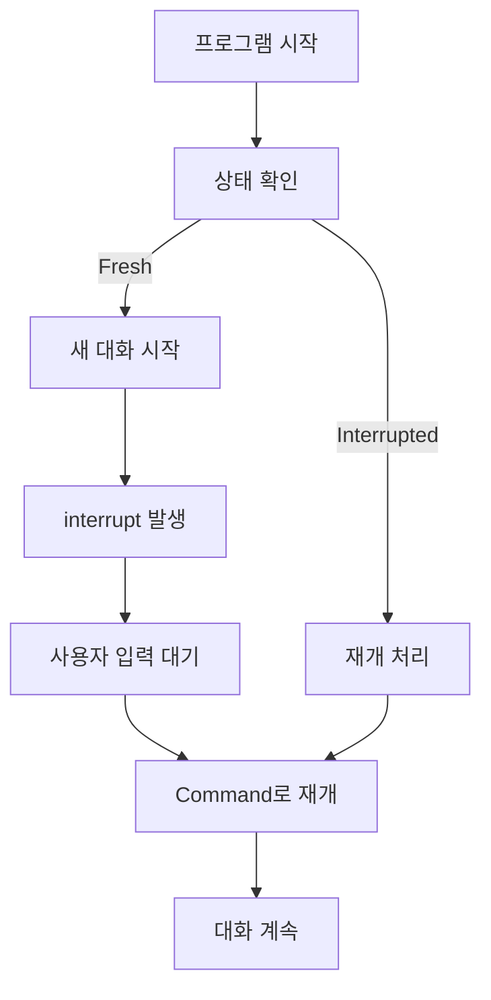

# 🤖 Human-in-the-Loop 챗봇 (TypeScript 패턴)

**TypeScript 참조 구현을 따른 Python Human-in-the-Loop 챗봇**

LangGraph의 공식 `interrupt()` 함수와 `Command` 패턴을 사용하여 간단하고 직관적인 Human-in-the-Loop 시스템을 구현했습니다.

## ✨ **주요 특징**

- ✅ **LangGraph 공식 패턴**: `interrupt()` + `Command` 사용
- ✅ **SQL문 없음**: 내장 체크포인터만 사용
- ✅ **단일 프로세스**: 별도 프로그램 불필요
- ✅ **TypeScript 패턴**: 동일한 설계 철학
- ✅ **간단함**: 200줄 미만의 깔끔한 코드

## 📁 **파일 구조**

```
study/getStarted/
├── basicChatbotWithHumanInTheLoop.py  # 🆕 TypeScript 패턴 구현
├── config.py                          # 설정 파일
├── ts_pattern.db                      # SQLite 체크포인터 (자동 생성)
└── README_typescript_pattern.md       # 이 문서
```

## 🚀 **빠른 시작**

### 1. **설치**

```bash
# 프로젝트 디렉토리로 이동
cd study/getStarted

# 필요한 패키지가 설치되어 있는지 확인
pip install langchain-community langchain-openai langgraph tavily-python
```

### 2. **실행**

```bash
python basicChatbotWithHumanInTheLoop.py
```

### 3. **첫 번째 대화**

```
🤖 TypeScript 패턴 Human-in-the-Loop 챗봇
✨ interrupt() + Command 패턴 사용
📝 SQL문 없이 LangGraph 내장 메커니즘만 사용

=== 현재 상태 ===
새로운 시작: True
다음 노드: None
메시지 수: 0
================

User (새 대화): 안녕하세요!
```

## 📖 **사용법 상세**

### **🆕 새로운 대화**

```
User (새 대화): LangGraph에 대해 알려주세요
🆕 새로운 대화를 시작합니다...
🔍 도구를 실행합니다...
Assistant: LangGraph는 LangChain의 그래프 기반 워크플로우...
```

### **🔄 Human-in-the-Loop 실행**

```
User (새 대화): AI 개발에 대한 전문가 조언이 필요해요

🆕 새로운 대화를 시작합니다...
🔍 도구를 실행합니다...

🤖 AI: AI 개발에 대한 전문가 조언이 필요합니다
🔄 인간의 입력을 기다립니다...
🔄 Interrupt 발생: NodeInterrupt occurred
인간의 입력이 필요합니다!

=== 현재 상태 ===
새로운 시작: False
다음 노드: tools
메시지 수: 2
================

현재 interrupt 상태입니다.
👤 Human Input (재개): AI 개발 시에는 명확한 목표 설정과 단계별 접근이 중요합니다

🔄 사용자 입력으로 대화를 재개합니다: AI 개발 시에는...
👤 인간이 입력한 값: AI 개발 시에는...
Assistant: 전문가 조언을 바탕으로...
```

## 🏗️ **아키텍처 비교**

### **기존 방식 (복잡함)**

```mermaid
graph TD
    A[메인 프로세스] --> B[interrupt 발생]
    B --> C[sys.exit(0)]
    C --> D[SQLite에 상태 저장]
    D --> E[별도 프로그램 실행]
    E --> F[SQL로 상태 조회]
    F --> G[Human input 수집]
    G --> H[SQL로 응답 저장]
    H --> I[메인 프로세스 재시작]
    I --> J[SQL로 상태 복원]
```

### **TypeScript 패턴 (간단함)**



## 🔧 **핵심 구현**

### **1. interrupt() 함수**

```python
@tool
def human_assistance(query: str) -> str:
    print(f"\n🤖 AI: {query}")
    print("🔄 인간의 입력을 기다립니다...")

    # 🎯 핵심: LangGraph 공식 interrupt() 사용
    value = interrupt({
        "type": "human_assistance",
        "query": query,
        "timestamp": "지금"
    })

    print(f"👤 인간이 입력한 값: {value}")
    return f"전문가 조언: {value}"
```

### **2. 상태 확인**

```python
def get_current_state(thread_id: str = "main"):
    """TypeScript의 getNextNode() 패턴"""
    config = {"configurable": {"thread_id": thread_id}}
    snapshot = graph.get_state(config)
    is_fresh_start = len(snapshot.next) == 0

    return {
        "is_fresh_start": is_fresh_start,
        "next_node": snapshot.next[0] if snapshot.next else None,
        "config": config
    }
```

### **3. Command로 재개**

```python
def resume_conversation(user_input: str, config: dict):
    """TypeScript의 Command 패턴"""
    for chunk in graph.stream(
        Command(resume=user_input),  # 🎯 핵심: Command 사용
        config
    ):
        # 응답 처리...
```

## 📊 **성능 비교**

| 항목             | 기존 방식      | TypeScript 패턴 |
| ---------------- | -------------- | --------------- |
| **코드 라인 수** | 668줄          | 209줄           |
| **파일 수**      | 2개 (분리)     | 1개             |
| **SQL 쿼리**     | 10+ 개         | 0개             |
| **프로세스**     | 2개 (분리)     | 1개             |
| **시작 시간**    | 느림 (DB 복원) | 빠름            |
| **디버깅**       | 어려움         | 쉬움            |
| **유지보수**     | 복잡           | 간단            |

## 🛠️ **설정**

### **모델 설정**

```python
# config.py에서 설정
OLLAMA_MODEL = "gemma3:latest"  # Ollama 모델
OPENAI_API_KEY = "sk-..."      # OpenAI API 키 (선택사항)
```

**자동 모델 선택**:

- OpenAI API 키가 있으면 → GPT-4o-mini 사용
- API 키가 없으면 → Ollama 로컬 모델 사용

### **데이터베이스**

```python
# 단순한 체크포인터만 사용 (SQL문 없음)
conn = sqlite3.connect("./ts_pattern.db", check_same_thread=False)
memory = SqliteSaver(conn)
```

## 🎯 **장점**

### **1. 간결성**

- **200줄 미만**의 깔끔한 코드
- **단일 파일**로 모든 기능 구현
- **복잡한 SQL 로직 제거**

### **2. 안정성**

- **프로세스 종료 없음** (sys.exit 제거)
- **LangGraph 표준 패턴** 준수
- **예외 처리 간소화**

### **3. 개발 효율성**

- **빠른 디버깅** (단일 프로세스)
- **쉬운 확장** (표준 패턴)
- **TypeScript와 동일한 구조**

### **4. 사용자 경험**

- **즉시 응답** (별도 프로그램 불필요)
- **상태 표시** (현재 위치 명확)
- **직관적 인터페이스**

## 🔄 **워크플로우**

### **전체 흐름**

1. **프로그램 시작** → 상태 확인
2. **Fresh Start?**
   - Yes → 새 대화 시작
   - No → Interrupt 상태에서 재개
3. **interrupt() 발생** → 사용자 입력 대기
4. **Command(resume=input)** → 대화 재개
5. **1번으로 돌아가서 반복**

### **상태 전환**

```
Fresh Start → Running → Interrupted → Resumed → Fresh Start
```

## 🚨 **TypeScript vs Python 차이점**

| 측면               | TypeScript | Python (이 구현) |
| ------------------ | ---------- | ---------------- |
| **interrupt 처리** | 자동       | 수동 입력 받기   |
| **에러 핸들링**    | try-catch  | try-except       |
| **타입 시스템**    | 강타입     | TypedDict 사용   |
| **모듈 시스템**    | ES6 import | Python import    |

## 📈 **향후 개선 방향**

### **1. 단기 개선**

- [ ] 더 나은 에러 메시지
- [ ] 대화 기록 UI 개선
- [ ] 설정 파일 확장

### **2. 장기 개선**

- [ ] 웹 인터페이스 연동
- [ ] 실시간 알림 시스템
- [ ] 멀티 스레드 지원
- [ ] 플러그인 아키텍처

## 🤝 **기여하기**

이 구현은 **TypeScript 참조 구현을 Python으로 포팅**한 것입니다.

### **개선 제안**

1. **성능 최적화**
2. **기능 추가**
3. **버그 수정**
4. **문서 개선**

## 📞 **지원**

- **이슈 리포트**: GitHub Issues
- **기능 요청**: Feature Request
- **질문**: Discussions

---

> 💡 **Tip**: TypeScript 원본 구현(`study/sqllite_ref/`)과 비교해보며 학습하세요!

> 🎓 **학습 포인트**: LangGraph의 공식 패턴을 이해하고 언어별 차이점을 파악해보세요!
