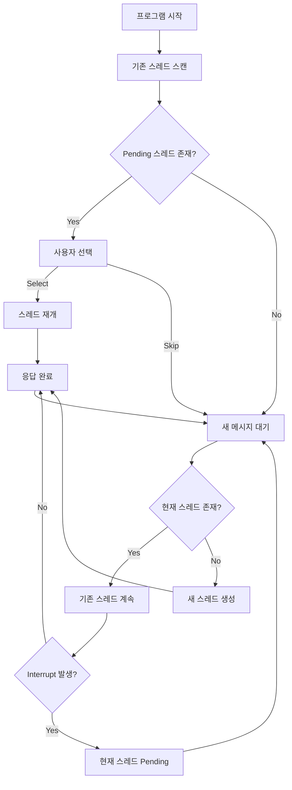
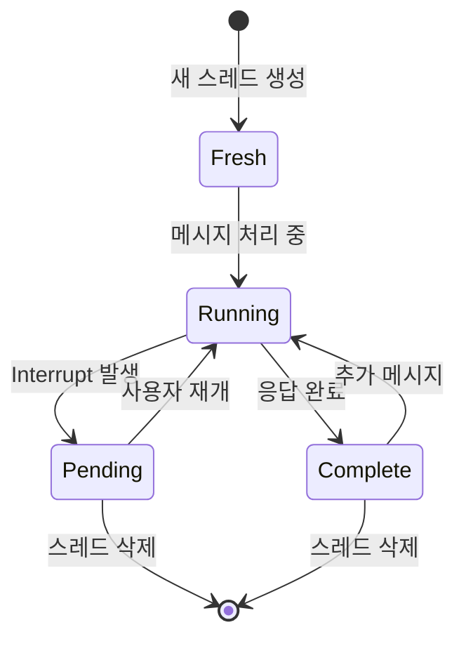

# 🚀 고도화된 멀티 스레드 Human-in-the-Loop 챗봇

**LangGraph 기반 멀티 스레드 Human-in-the-Loop 시스템**

TypeScript 패턴에서 시작하여 **멀티 스레드 관리, 인터럽트 처리, 스레드 히스토리** 등 고도화된 기능을 구현한 프로덕션 레벨 챗봇입니다.

## ✨ **주요 특징**

### **🎯 핵심 기능**

- ✅ **멀티 스레드 관리**: 여러 대화를 동시에 관리
- ✅ **고도화된 Interrupt**: 인터럽트 시 자동 새 스레드 생성
- ✅ **스레드 라이프사이클**: pending → 재개 → 완료
- ✅ **파일 기반 추적**: SQL 대신 JSON으로 스레드 관리
- ✅ **Command 시스템**: pending, threads, select, clear 등
- 🆕 **인간 검토 맥락**: 사용자 질문 + AI 요청 + 대화 요약
- 🆕 **대화 중심 히스토리**: 실제 대화 내용 시각화

### **🔧 기술적 특징**

- ✅ **LangGraph 공식 패턴**: `interrupt()` + `Command` 기반
- ✅ **OpenAI API 오류 방지**: 완전한 tool_calls 응답 처리
- ✅ **실시간 도구 실행**: Tavily 검색 + Human assistance
- ✅ **상태 보존**: 스레드별 독립적 상태 관리

## 📁 **파일 구조**

```
study/getStarted/
├── advancedChatbotWithHumanInTheLoop.py  # 🆕 고도화된 멀티 스레드 시스템
├── basicChatbotWithHumanInTheLoop.py     # 기본 TypeScript 패턴
├── config.py                             # 환경 설정
├── active_threads.json                   # 스레드 추적 파일 (자동 생성)
├── advanced_pattern.db                   # SQLite 체크포인터 (자동 생성)
└── README_typescript_pattern.md          # 이 문서
```

## 🚀 **빠른 시작**

### 1. **환경 설정**

```bash
# .env 파일 생성 (선택사항)
OPENAI_API_KEY=sk-your-openai-key
TAVILY_API_KEY=tvly-your-tavily-key
OLLAMA_BASE_URL=http://localhost:11434
OLLAMA_MODEL=gemma3:latest
```

### 2. **실행**

```bash
cd study/getStarted
python advancedChatbotWithHumanInTheLoop.py
```

### 3. **첫 번째 실행**

```
🚀 고도화된 멀티 스레드 Human-in-the-Loop 챗봇
✨ 멀티 스레드 관리, Interrupt 선택, State History
----------------------------------------------------------------------

📁 기존 스레드 추적 파일 발견.
✅ 2개의 유효한 기존 스레드가 발견되었습니다.

🔍 1개의 pending 스레드를 발견했습니다!
Pending 스레드를 처리하시겠습니까? (y/n):

📋 명령어:
- 일반 메시지: 현재 스레드에서 대화 계속 (없으면 새 스레드)
- 'new': 새 스레드 시작
- 'pending': Pending 스레드 목록 보기
- 'threads': 모든 스레드 목록 보기
- 'select': Pending 스레드 선택하여 재개
- 'history <thread_id>': 특정 스레드 히스토리 보기
- 'clear': 모든 스레드 삭제
- 'quit': 종료

🎯 입력:
```

## 📖 **사용법 가이드**

### **🆕 새로운 대화 시작**

```bash
🎯 입력: 안녕하세요! LangGraph에 대해 알려주세요
New thread 'thread_abc123_143052' started...
🔧 도구 호출: ['tavily_search']
🔍 검색 결과: LangGraph는 상태 기반 그래프 워크플로우를...
Assistant: LangGraph는 LangChain에서 개발한 강력한 그래프 기반...
📍 현재 스레드: thread_abc123_143052
```

### **🔄 Human-in-the-Loop 실행**

```bash
🎯 입력: 인간 검토 필요
🔧 도구 호출: ['human_assistance']

🤖 AI: 인간 검토 필요
🔄 Human input이 필요합니다. 현재 스레드가 일시정지됩니다...
🔄 Thread 'thread_abc123_143052'에서 interrupt 발생!
📋 이 스레드는 pending 상태가 되었습니다.
💡 'select' 명령어로 나중에 재개할 수 있습니다.

🎯 입력: 새로운 질문
🆕 새로운 스레드에서 메시지를 처리합니다...
New thread 'thread_def456_143155' started...
📍 현재 스레드: thread_def456_143155
```

### **📋 스레드 관리**

```bash
# 모든 스레드 확인
🎯 입력: threads
All threads (3):
- thread_abc123_143052: Pending | 6 messages
- thread_def456_143155: Complete | 4 messages
- thread_ghi789_143201: Complete | 8 messages

# Pending 스레드만 확인
🎯 입력: pending
Pending threads (1):
- thread_abc123_143052: 인간 검토 필요

# 스레드 선택하여 재개 (🆕 인간 검토 맥락 포함)
🎯 입력: select
🔍 Pending Threads (1):
======================================================================
1. 📧 thread_abc123_143052
   📋 Status: Waiting for tools
   📊 Messages: 6
   👤 User Question: 인간 검토 필요
   🤖 AI Needs Help: LangGraph 정보에 대한 전문가 검토가 필요합니다
   💬 Recent: 👤LangGraph에 대해 알려주세요 → 🤖LangGraph는... → 👤인간 검토 필요
----------------------------------------------------------------------

Select (1-1, 'h'+number for history, '0' cancel): 1
Selected: thread_abc123_143052
👤 Human Input: 검토 완료, 승인합니다
Resuming thread 'thread_abc123_143052'...
👤 인간이 입력한 값: 검토 완료, 승인합니다
Assistant: 전문가 조언: 검토 완료, 승인합니다
```

### **📜 스레드 히스토리 (🆕 대화 중심 표시)**

```bash
🎯 입력: history thread_abc123_143052

=== 💬 Thread History: thread_abc123_143052 ===

--- Step 1 (2025-07-28 23:58:10) ---
👤 User: LangGraph에 대해 알려주세요
🔧 AI: [도구 호출: tavily_search]
🔍 tavily_search: LangGraph는 LangChain에서 개발한 상태 기반 그래프...
🤖 AI: LangGraph는 LangChain 팀에서 개발한 강력한 라이브러리로, 복잡한 AI 워크플로우를 그래프 기반으로 구성할 수 있게 해줍니다...

--- Step 2 (2025-07-28 23:58:15) ---
👤 User: 인간 검토 필요
🔧 AI: [도구 호출: human_assistance]

--- Step 3 (2025-07-29 00:00:05) ---
🔍 human_assistance: 전문가 조언: 검토 완료, 승인합니다
🤖 AI: 검토해주신 내용을 바탕으로 LangGraph 정보를 최종 확정하겠습니다...

✅ Thread Status: Complete
==================================================
```

### **🗑️ 스레드 정리**

```bash
🎯 입력: clear
⚠️ 모든 스레드를 삭제하시겠습니까? (y/N): y
✅ 3개의 스레드가 삭제되었습니다.
📁 데이터베이스 파일도 삭제됨: advanced_pattern.db
🆕 새로운 대화를 시작할 수 있습니다.
🔄 모든 스레드가 삭제되었습니다. 새로운 시작!
```

## 🏗️ **시스템 아키텍처**

### **멀티 스레드 워크플로우**



### **스레드 상태 관리**



## 🔧 **핵심 구현**

### **1. 고도화된 Interrupt 처리**

```python
@tool
def human_assistance(query: str) -> str:
    """Human assistance 도구 - 실제 interrupt 발생"""
    print(f"\n🤖 AI: {query}")
    print("🔄 Human input이 필요합니다. 현재 스레드가 일시정지됩니다...")

    # TypeScript 패턴: interrupt가 여기서 발생하고 실행 중단
    value = interrupt({
        "type": "human_assistance",
        "query": query,
        "timestamp": datetime.now().isoformat(),
        "status": "pending"
    })

    print(f"👤 인간이 입력한 값: {value}")
    return f"전문가 조언: {value}"
```

### **2. 스레드 상태 감지 및 보호**

```python
def is_thread_pending(thread_id: str) -> bool:
    """스레드가 pending 상태인지 확인"""
    try:
        config = {"configurable": {"thread_id": thread_id}}
        snapshot = graph.get_state(config)

        if snapshot and hasattr(snapshot, 'next') and snapshot.next:
            # next가 있으면 pending 상태
            return True
        return False
    except:
        return False

def continue_conversation(user_input: str, thread_id: str) -> str:
    """기존 스레드에서 대화 계속하기"""

    # 먼저 스레드가 pending 상태인지 확인
    if is_thread_pending(thread_id):
        print(f"⚠️ Thread '{thread_id}'는 pending 상태입니다.")
        print("💡 'select' 명령어로 재개하거나 새 스레드에서 시작하세요.")
        return None  # OpenAI API 오류 방지
```

### **3. 파일 기반 스레드 추적**

```python
def save_active_threads():
    """활성 스레드 목록을 파일에 저장"""
    global _active_threads

    try:
        with open("./active_threads.json", 'w') as f:
            json.dump(list(_active_threads), f)
    except Exception as e:
        pass  # 저장 실패는 치명적이지 않음

def discover_existing_threads():
    """기존 스레드 발견 - 파일 기반 추적"""
    global _active_threads

    try:
        if os.path.exists("./active_threads.json"):
            with open("./active_threads.json", 'r') as f:
                saved_threads = json.load(f)

            # 저장된 스레드들이 실제로 유효한지 확인
            valid_threads = set()
            for thread_id in saved_threads:
                try:
                    config = {"configurable": {"thread_id": thread_id}}
                    snapshot = graph.get_state(config)
                    if snapshot and snapshot.values:
                        valid_threads.add(thread_id)
                except:
                    pass

            _active_threads = valid_threads
            if _active_threads:
                print(f"✅ {len(_active_threads)}개의 유효한 기존 스레드가 발견되었습니다.")
```

### **4. 인간 검토 맥락 추출 (🆕)**

```python
def get_thread_context(thread_id: str) -> Dict:
    """스레드의 인간 검토 맥락 정보 추출"""
    try:
        thread_config = {"configurable": {"thread_id": thread_id}}
        snapshot = graph.get_state(thread_config)

        messages = snapshot.values.get("messages", [])
        user_question = "No user question found"
        ai_request = "No AI request found"

        # 뒤에서부터 찾기 (최신부터)
        for msg in reversed(messages):
            msg_type = msg.__class__.__name__
            content = getattr(msg, 'content', '')

            # 사용자의 마지막 질문
            if msg_type == 'HumanMessage' and user_question == "No user question found":
                user_question = content[:100] + "..." if len(content) > 100 else content

            # AI의 human_assistance 도구 호출 찾기
            elif msg_type == 'AIMessage' and hasattr(msg, 'tool_calls') and msg.tool_calls:
                for tool_call in msg.tool_calls:
                    if tool_call.get('name') == 'human_assistance':
                        args = tool_call.get('args', {})
                        query = args.get('query', 'No query specified')
                        ai_request = query[:150] + "..." if len(query) > 150 else query
                        break

        # 대화 요약 (최근 3개 메시지)
        recent_messages = messages[-3:] if len(messages) >= 3 else messages
        summary_parts = []
        for msg in recent_messages:
            msg_type = msg.__class__.__name__
            content = getattr(msg, 'content', '')[:50]
            if msg_type == 'HumanMessage':
                summary_parts.append(f"👤{content}")
            elif msg_type == 'AIMessage' and not hasattr(msg, 'tool_calls'):
                summary_parts.append(f"🤖{content}")

        summary = " → ".join(summary_parts) if summary_parts else "No conversation summary"

        return {
            "user_question": user_question,
            "ai_request": ai_request,
            "summary": summary
        }
    except Exception as e:
        return {"user_question": f"Error: {e}", "ai_request": f"Error: {e}", "summary": f"Error: {e}"}
```

### **5. 인터랙티브 스레드 선택 (🆕 맥락 포함)**

```python
def select_thread_interactive():
    """인터랙티브 스레드 선택 - 인간 검토 맥락과 함께"""
    pending_threads = get_pending_threads()

    if not pending_threads:
        print("No pending threads.")
        return None

    print(f"\n🔍 Pending Threads ({len(pending_threads)}):")
    print("=" * 70)

    for i, thread in enumerate(pending_threads, 1):
        context = get_thread_context(thread['thread_id'])

        print(f"{i}. 📧 {thread['thread_id']}")
        print(f"   📋 Status: Waiting for {thread['next_node']}")
        print(f"   📊 Messages: {thread['message_count']}")
        print(f"   👤 User Question: {context['user_question']}")
        print(f"   🤖 AI Needs Help: {context['ai_request']}")
        print(f"   💬 Recent: {context['summary']}")
        print("-" * 70)

    while True:
        try:
            choice = input(f"\nSelect (1-{len(pending_threads)}, 'h'+number for history, '0' cancel): ").strip()

            if choice == '0':
                return None
            elif choice.startswith('h') and len(choice) > 1:
                # 히스토리 보기
                try:
                    idx = int(choice[1:]) - 1
                    if 0 <= idx < len(pending_threads):
                        show_thread_history(pending_threads[idx]['thread_id'])
                except:
                    print("❌ 잘못된 형식입니다.")
            else:
                # 스레드 선택
                idx = int(choice) - 1
                if 0 <= idx < len(pending_threads):
                    selected = pending_threads[idx]['thread_id']
                    print(f"Selected: {selected}")
                    return selected
                else:
                    print(f"❌ 1-{len(pending_threads)} 범위에서 선택하세요.")
        except ValueError:
            print("❌ 숫자를 입력하세요.")
```

### **6. 대화 중심 히스토리 표시 (🆕)**

```python
def show_thread_history(thread_id: str) -> None:
    """특정 스레드의 대화 히스토리 조회 - 실제 대화 내용 중심"""
    try:
        thread_config = {"configurable": {"thread_id": thread_id}}

        print(f"\n=== 💬 Thread History: {thread_id} ===")

        # 모든 snapshot을 리스트로 수집 후 역순으로 정렬 (최신이 아래에)
        snapshots = list(graph.get_state_history(thread_config))
        if not snapshots:
            print("📭 No conversation history found.")
            return

        # 이전 메시지 수를 추적하여 새로운 메시지만 출력
        prev_message_count = 0
        step_count = 0

        for snapshot in reversed(snapshots):  # 시간순으로 출력
            messages = snapshot.values.get("messages", [])
            current_count = len(messages)

            # 새로운 메시지가 추가된 경우에만 출력
            if current_count > prev_message_count:
                step_count += 1

                # 시간 정보 (간단히)
                if snapshot.created_at:
                    time_str = str(snapshot.created_at)[:19].replace('T', ' ')
                    print(f"\n--- Step {step_count} ({time_str}) ---")

                # 새로 추가된 메시지들만 출력
                new_messages = messages[prev_message_count:]
                for msg in new_messages:
                    content = msg.content.strip()
                    msg_type = msg.__class__.__name__

                    if msg_type == 'HumanMessage':
                        print(f"👤 User: {content}")
                    elif msg_type == 'AIMessage':
                        # tool_calls가 있는 경우 (도구 호출)
                        if hasattr(msg, 'tool_calls') and msg.tool_calls:
                            tools = [tc.get('name', 'unknown') for tc in msg.tool_calls]
                            print(f"🔧 AI: [도구 호출: {', '.join(tools)}]")
                        else:
                            # 일반 AI 응답
                            if len(content) > 200:
                                content = content[:200] + "..."
                            print(f"🤖 AI: {content}")
                    elif msg_type == 'ToolMessage':
                        # 도구 실행 결과는 간단히
                        tool_name = msg.name
                        preview = content[:50] + "..." if len(content) > 50 else content
                        print(f"🔍 {tool_name}: {preview}")

                prev_message_count = current_count

        # 현재 상태 표시
        final_snapshot = snapshots[0]  # 가장 최신
        if final_snapshot.next:
            print(f"\n📋 Current Status: Pending (waiting for: {final_snapshot.next[0]})")
        else:
            print(f"\n✅ Thread Status: Complete")

        print("=" * 50)

    except Exception as e:
        print(f"❌ Error reading history: {e}")
```

## 📊 **성능 및 기능 비교**

### **진화 단계**

| 단계            | 기능                     | 라인 수 | 복잡도 |
| --------------- | ------------------------ | ------- | ------ |
| **기본 HIL**    | 단순 interrupt           | 200줄   | 낮음   |
| **TypeScript**  | Command 패턴             | 220줄   | 중간   |
| **멀티 스레드** | 스레드 관리 + 고도화     | 650줄   | 높음   |
| **🆕 v2.0**     | 맥락 포함 + 대화 중심 UI | 750줄   | 고급   |

### **주요 개선사항**

| 기능                 | 기본   | 고도화    | 🆕 v2.0       |
| -------------------- | ------ | --------- | ------------- |
| **스레드 수**        | 1개    | 무제한    | 무제한        |
| **Interrupt 처리**   | 기본   | 자동 분리 | 자동 분리     |
| **상태 관리**        | 메모리 | 파일      | 파일          |
| **UI 인터랙션**      | 기본   | 고도화    | **맥락 포함** |
| **오류 처리**        | 기본   | 완전      | 완전          |
| **히스토리 조회**    | 없음   | 메타 정보 | **대화 중심** |
| **스레드 정리**      | 수동   | 자동      | 자동          |
| **인간 검토 맥락**   | 없음   | 없음      | **완전**      |
| **대화 흐름 시각화** | 없음   | 없음      | **완전**      |

## 🛠️ **설정 및 환경**

### **API 키 설정 (config.py)**

```python
import os
from dotenv import load_dotenv

load_dotenv()

# LLM 설정
OPENAI_API_KEY = os.getenv("OPENAI_API_KEY")
OLLAMA_BASE_URL = os.getenv("OLLAMA_BASE_URL", "http://localhost:11434")
OLLAMA_MODEL = os.getenv("OLLAMA_MODEL", "gemma3:latest")

# 도구 설정
TAVILY_API_KEY = os.getenv("TAVILY_API_KEY")
```

### **자동 모델 선택**

```python
# OpenAI API 키가 있으면 GPT 사용, 없으면 Ollama 사용
if OPENAI_API_KEY:
    llm = init_chat_model("openai:gpt-4o-mini", api_key=OPENAI_API_KEY)
    print("🤖 OpenAI GPT-4o-mini 모델 사용")
else:
    llm = init_chat_model("ollama:gemma3:latest", base_url=OLLAMA_BASE_URL)
    print("🦙 Ollama Gemma3 모델 사용")
```

### **조건부 도구 활성화**

```python
# Tavily API 키가 있을 때만 검색 기능 활성화
if TAVILY_API_KEY:
    tavily_search = TavilySearch(max_results=5)
    tools = [tavily_search, human_assistance]
    print("🔍 Tavily 검색 도구가 활성화되었습니다.")
else:
    tools = [human_assistance]
    print("⚠️ TAVILY_API_KEY가 설정되지 않아 검색 기능이 비활성화됩니다.")
```

## 🚨 **중요한 개념**

### **StateGraph 실행 모델**

```bash
# END ≠ 스레드 종료, 실행(execution) 완료
Thread: thread_abc123
├── Execution 1: Messages 1-4 → END
├── Execution 2: Messages 4-8 → END  # 새 메시지로 재시작
└── Execution 3: Messages 8-?  → (진행 중)

# 매번 새로운 실행이지만 상태는 누적됨
```

### **Interrupt vs 새 스레드**

```bash
# Interrupt 발생 시
Current Thread: thread_abc → PENDING 상태
Next Message: 새로운 thread_def에서 시작

# Pending 스레드 접근 시
⚠️ Thread 'abc'는 pending 상태입니다.
💡 'select' 명령어로 재개하거나 새 스레드에서 시작하세요.
```

## 🎯 **고급 사용법**

### **명령어 치트시트**

```bash
# 스레드 관리
threads          # 모든 스레드 목록
pending          # pending 스레드만 목록
select           # pending 스레드 선택하여 재개
history <id>     # 특정 스레드 히스토리

# 세션 관리
new              # 명시적 새 스레드 시작
clear            # 모든 스레드 삭제
quit             # 프로그램 종료

# 히스토리 조회 중 단축키
h1, h2, h3...    # 스레드 히스토리 미리보기
0                # 선택 취소
```

### **파워 유저 팁**

```bash
# 1. 복잡한 작업 분할
🎯 입력: 논문 작성 계획
→ AI가 계획 생성
🎯 입력: 인간 검토 필요
→ Thread pending 처리

🎯 입력: 관련 논문 검색
→ 새 스레드에서 병렬 작업

# 2. 멀티태스킹
🎯 입력: select
→ 첫 번째 작업 재개
🎯 입력: 수정된 계획입니다
→ 작업 완료

🎯 입력: 다른 질문
→ 또 다른 새 스레드
```

## 📈 **향후 로드맵**

### **단기 목표 (완료)**

- [x] 멀티 스레드 관리
- [x] Interrupt 고도화
- [x] 파일 기반 추적
- [x] 인터랙티브 UI
- [x] 오류 처리 완성
- [x] 🆕 인간 검토 맥락 추출
- [x] 🆕 대화 중심 히스토리

### **중기 목표**

- [ ] 웹 인터페이스 연동
- [ ] RESTful API 지원
- [ ] 스레드 태깅 시스템
- [ ] 백그라운드 작업 지원
- [ ] 스레드 즐겨찾기 기능

### **장기 목표**

- [ ] 클러스터링 지원
- [ ] 실시간 협업
- [ ] AI 에이전트 오케스트레이션
- [ ] 엔터프라이즈 통합

## 🎉 **v2.0 주요 업데이트**

### **🔍 인간 검토 맥락 (Context-Aware HIL)**

- **문제**: 이전에는 어떤 상황에서 interrupt가 발생했는지 알기 어려웠음
- **해결**: `get_thread_context()` 함수로 사용자 질문, AI 요청 이유, 대화 흐름을 추출
- **결과**: 인간이 정확한 맥락을 파악하고 적절한 응답 제공 가능

### **💬 대화 중심 히스토리 (Conversation-Focused History)**

- **문제**: 이전 히스토리는 메타 정보(timestamp, node) 위주로 가독성 부족
- **해결**: 실제 User/AI 대화 내용을 시간순으로 명확하게 표시
- **결과**: 대화 흐름을 자연스럽게 파악하고 컨텍스트 이해 향상

### **🎯 개선된 UX**

```bash
# 이전 (기술적 정보 위주)
1. thread_abc123
   Next: tools
   Messages: 6
   Last: 인간 검토 필요

# 현재 (맥락 풍부)
1. 📧 thread_abc123
   📋 Status: Waiting for tools
   📊 Messages: 6
   👤 User Question: LangGraph 정보 확인 요청
   🤖 AI Needs Help: 전문가 검토가 필요합니다
   💬 Recent: 👤질문 → 🤖검색 → 👤검토요청
```

---

> 💡 **Tip**: 이 시스템은 **프로덕션 레벨의 멀티 스레드 AI 시스템** 기반이 됩니다!

> 🎓 **학습 포인트**: TypeScript에서 Python으로, 기본에서 고도화까지의 진화 과정을 학습하세요!

> 🚀 **미래**: 이 아키텍처는 **대규모 AI 에이전트 시스템**의 핵심 컴포넌트가 될 수 있습니다!

> 🆕 **v2.0**: **인간과 AI의 협업을 위한 완전한 맥락 인식 시스템**으로 진화했습니다!
